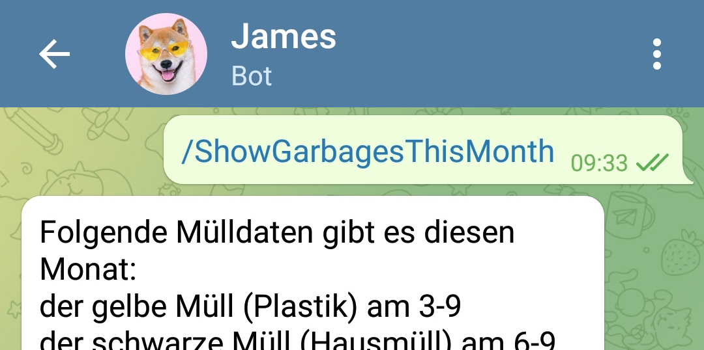

# JamesBot
JamesBot is a Telegram Reminder Bot for Birthdays and Garbage Dates (for me who neither has facebook nor a very good date memory). 

## Deployment
JamesBot is deployed as three different NodeJS AWS Lambda functions (two for sending reminder messages triggered via cronjobs, one for processing user requests from a telegram chat).  
An AWS API Gateway is used for polling in order to process user requests directly.

## Implementation
Jamesbot is fully written in Typescript. The main framework used for the telegram mechanics is [telegraf](https://github.com/telegraf/telegraf).

